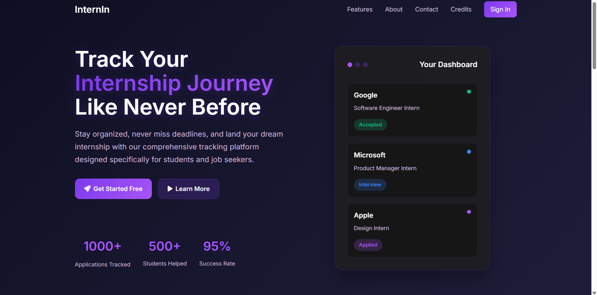
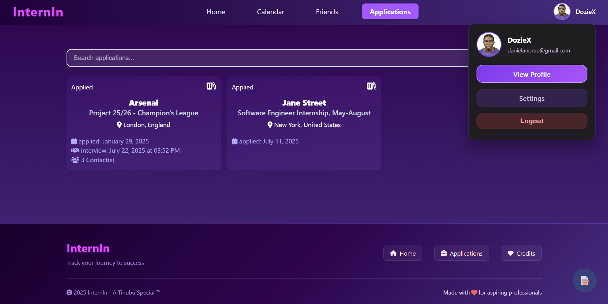
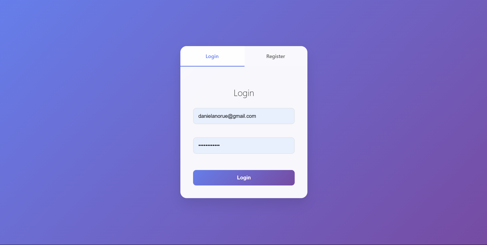
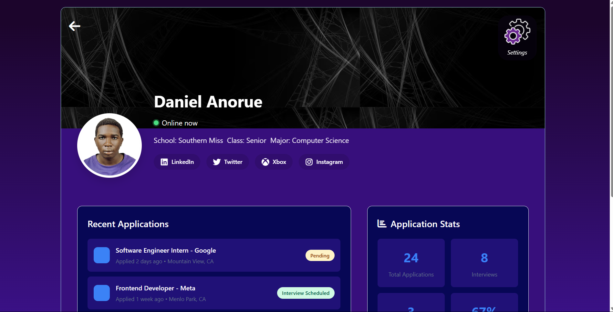
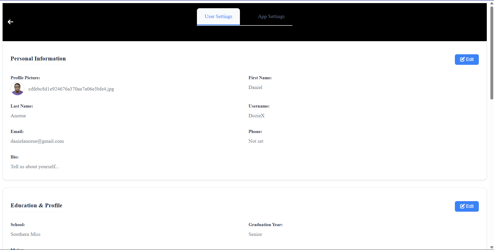

# 🎯 InternIn - Your Personal Internship Tracking Hub

[](https://www.python.org/downloads/)
[](https://flask.palletsprojects.com/)
[](https://www.sqlite.org/)
[](LICENSE)

A modern, feature-rich Flask web application designed to help students and job seekers organize, track, and optimize their internship search journey. Built by students, for students! 🚀

> **⚠️ Copyright Notice:** This project is the original work of DEN and is protected under Apache 2.0 License. While the code is open source for educational purposes, please respect the license terms and provide proper attribution if you use any part of this codebase.

## 📸 Application Screenshots

### 🏠 Landing Page


### 📊 Dashboard


### 🔐 Login Page


### 👤 Profile Page


### ⚙️ Settings Page


---

## ✨ Features

### 🔐 **Authentication & User Management**
- Secure user registration and login system
- Password hashing with Werkzeug security
- Session management with Flask-Login
- **Email-Based Password Reset**: Secure forgot password functionality with token-based verification
- Password change functionality with strength validation

### 📊 **Application Tracking**
- **Smart Application Management**: Track internship applications with detailed status updates
- **Advanced Status System**: Applied, Interviewing, Offered, Rejected, Accepted, Withdrawn, Waitlist
- **Next Action Tracking**: Set and track follow-up actions with dates
- **Contact Management**: Store recruiter and company contacts as structured data
- **Rich Notes System**: Add detailed notes with auto-save functionality

### 👤 **User Profiles & Social Features**
- **Complete User Profiles**: Personal information, education details, bio
- **Profile Pictures**: Upload custom profile pictures with fallback to initials
- **Social Media Integration**: Connect up to 6 social media accounts (14 platforms supported)
- **Major Selection**: Choose from 200+ academic majors with Select2 integration
- **Privacy Controls**: Manage profile visibility and data sharing

### ⚙️ **Advanced Settings**
- **Tabbed Settings Interface**: User settings and app preferences
- **Theme Customization**: Light, dark, and auto themes
- **Notification Preferences**: Email, reminders, and social notifications
- **Data Export**: Export applications in CSV/Excel format
- **Timezone Support**: Multiple timezone options

### 🎨 **Modern UI/UX**
- **Responsive Design**: Works on desktop, tablet, and mobile
- **Glass Morphism**: Modern glass-effect UI components
- **Dynamic Navigation**: Smart back button with navigation stack
- **Interactive Elements**: Hover effects, animations, and transitions
- **Font Awesome Icons**: 6000+ icons for better visual experience

### 📱 **Application Details**
- **Comprehensive Application View**: All details in one place
- **Status Badges**: Color-coded status indicators
- **Description Modal**: Popup modal for detailed job descriptions
- **Contact Cards**: Organized contact information display
- **Interactive Elements**: Click-to-edit notes and details

---

## 🛠️ Tech Stack

- **Backend**: Flask 2.3+, SQLAlchemy, Flask-Login
- **Frontend**: HTML5, CSS3, JavaScript (ES6+)
- **Database**: SQLite with JSON fields for complex data
- **Libraries**: 
  - Select2 for enhanced dropdowns
  - Font Awesome for icons
  - Pandas for data export (optional)
- **Security**: Werkzeug password hashing, CSRF protection

---

## 🚀 Quick Start

### Prerequisites
- Python 3.8 or higher
- pip package manager

### Installation

1. **Clone the repository**
   ```bash
   git clone https://github.com/YOUR_USERNAME/internship-tracker.git
   cd internship-tracker
   ```

2. **Create and activate virtual environment**
   ```bash
   # Windows
   python -m venv venv
   venv\Scripts\activate
   
   # macOS/Linux
   python3 -m venv venv
   source venv/bin/activate
   ```

3. **Install dependencies**
   ```bash
   pip install -r requirements.txt
   ```

4. **Run the application**
   ```bash
   python run.py
   ```

5. **Open your browser**
   Navigate to `http://127.0.0.1:5000`

### 🔧 Alternative Setup (Scripts)

For faster setup, use the provided scripts:

**Windows:**
```bash
setup.bat
```

**macOS/Linux:**
```bash
chmod +x setup.sh
./setup.sh
```

---

## 📁 Project Structure

```
internship-tracker/
│
├── app/                          # Main application package
│   ├── __init__.py              # App factory and configuration
│   ├── models.py                # Database models (User, Internship, Settings)
│   │
│   ├── auth/                    # Authentication blueprint
│   │   ├── __init__.py
│   │   └── routes.py            # Login, register, logout routes
│   │
│   ├── applications/            # Application management
│   │   ├── __init__.py
│   │   └── routes.py            # CRUD operations for applications
│   │
│   ├── profile/                 # User profile management
│   │   ├── __init__.py
│   │   └── routes.py            # Profile viewing and editing
│   │
│   ├── settings/                # Settings management
│   │   ├── __init__.py
│   │   └── routes.py            # User and app settings
│   │
│   ├── templates/               # Jinja2 templates
│   │   ├── layout.html          # Base template
│   │   ├── landing.html         # Landing page
│   │   ├── home.html            # Dashboard
│   │   ├── applications.html    # Applications list
│   │   ├── application-details.html
│   │   ├── profile.html
│   │   ├── settings.html
│   │   └── ...
│   │
│   └── static/                  # Static assets
│       ├── css/                 # Stylesheets
│       │   ├── layout.css       # Base styles
│       │   ├── applications.css
│       │   ├── profile.css
│       │   └── ...
│       ├── js/                  # JavaScript files
│       │   ├── applications.js
│       │   ├── settings.js
│       │   ├── nav.js
│       │   └── majors.json      # Academic majors data
│       └── uploads/             # User uploaded files
│           └── profile_pictures/
│
├── instance/                    # Instance-specific files
│   └── internships.db          # SQLite database
│
├── run.py                       # Application entry point
├── requirements.txt             # Python dependencies
├── .gitignore                   # Git ignore rules
├── LICENSE                      # Apache 2.0 license
└── README.md                    # This file
```

---

## 📊 Database Schema

### User Model
- Personal information (name, email, phone)
- Education details (school, major, graduation year)
- Profile customization (bio, profile picture)
- Social media links (up to 6 platforms)
- Privacy and notification settings

### Internship Model
- Application details (company, position, status)
- Dates (applied, next action due)
- Contact information (JSON field)
- Notes and descriptions
- Status tracking with 7 different states

### UserSettings Model
- Theme preferences
- Notification settings
- Privacy controls
- Data export preferences

---

## 🎨 Features Showcase

### 🏠 **Landing Page**
- Modern hero section with animated statistics
- Feature highlights with icons
- Call-to-action buttons
- Responsive navigation

### 📋 **Application Management**
- **List View**: Grid layout with status indicators
- **Detail View**: Comprehensive application information
- **Add/Edit Forms**: Dynamic forms with validation
- **Search & Filter**: Find applications quickly

### 👤 **User Profile**
- **Profile Display**: Clean, card-based layout
- **Social Links**: Dynamic social media integration
- **Edit Mode**: In-place editing with form validation
- **Profile Pictures**: Upload with preview and fallback

### ⚙️ **Settings Dashboard**
- **Tabbed Interface**: User settings and app preferences
- **Form Validation**: Real-time validation feedback
- **AJAX Updates**: Smooth, no-reload updates
- **Data Export**: One-click export functionality

---

## 🔒 Security Features

- **Password Security**: Werkzeug hashing with salt
- **Email-Based Password Reset**: Secure token-based password reset with expiration
- **Input Validation**: Server-side validation for all forms
- **File Upload Security**: Secure file handling for profile pictures
- **Session Management**: Secure session handling with Flask-Login
- **CSRF Protection**: Built-in protection against cross-site attacks

---

## 📱 Responsive Design

InternIn is fully responsive and works seamlessly across:
- **Desktop**: Full-featured experience
- **Tablet**: Optimized layouts for medium screens
- **Mobile**: Touch-friendly interface with mobile navigation

---

## 📝 License

This project is licensed under the Apache License 2.0 - see the [LICENSE](LICENSE) file for details.

---

## 🎉 Credits

**InternIn** was built by students, for students. Special thanks to:

- **Flask Community** for the excellent web framework
- **Font Awesome** for the comprehensive icon library
- **Select2** for enhanced dropdown functionality

---

## 📞 Support

If you have questions or need help:
Contact me(daniel.anorue@usm.edu), elyon (elyon.aganah@usm.edu) or neville(neville.onsomu@usm.edu)

---

<div align="center">

**Built with ❤️ by students, for students**

  *A DEN Special ™*

[⭐ Star this repo](https://github.com/YOUR_USERNAME/internship-tracker) if you found it helpful!

</div>
