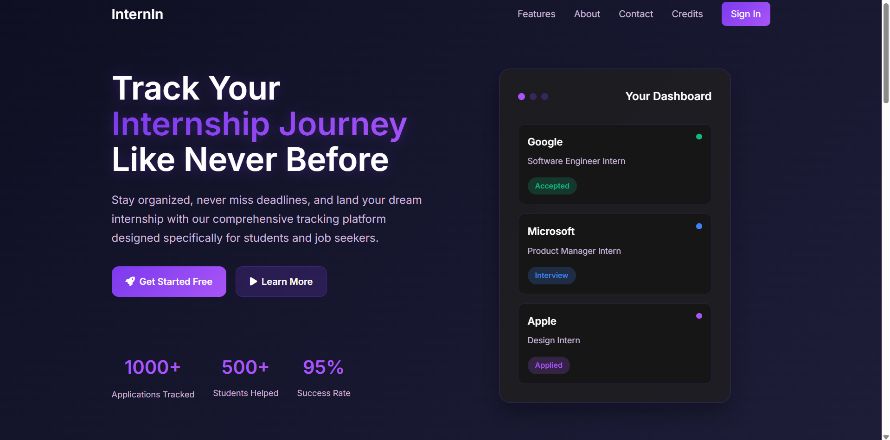
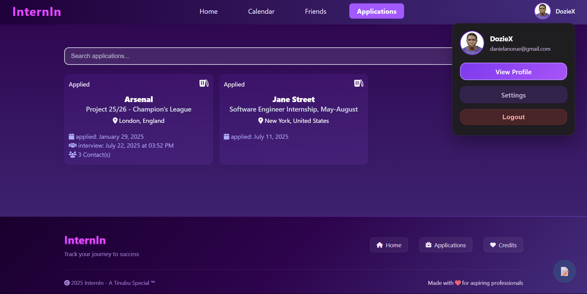
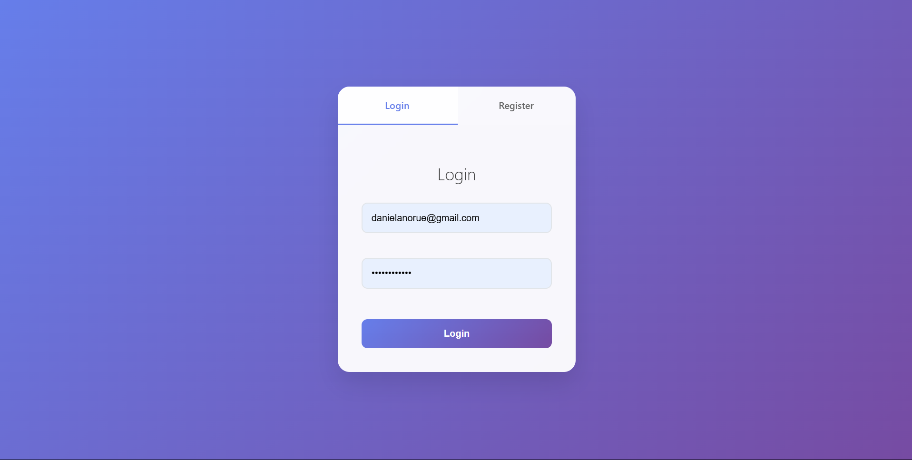
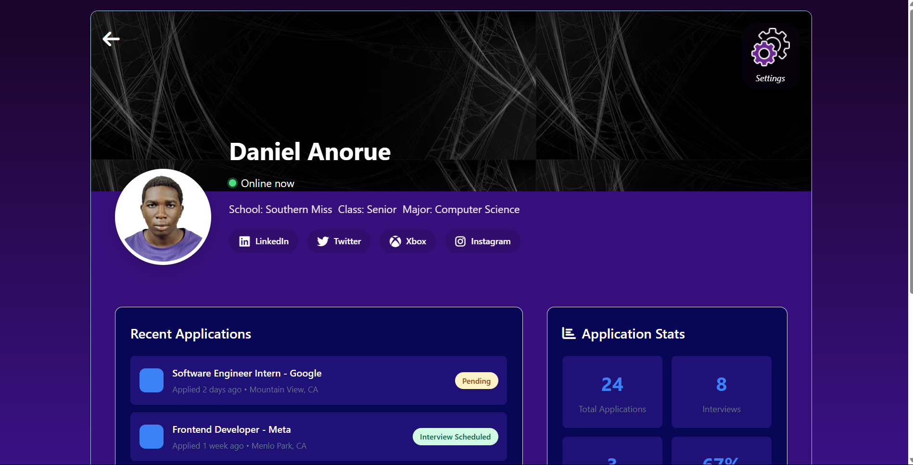
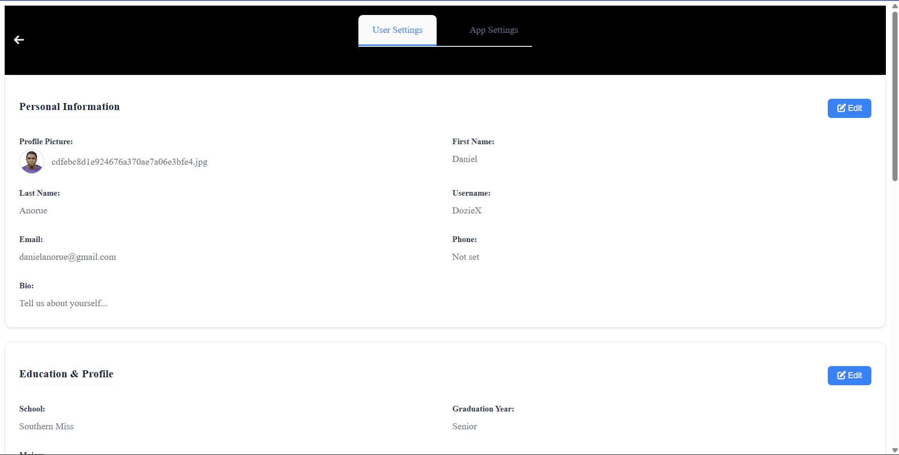

# InternIn
### Your Personal Internship Tracking Hub

InternIn is a full-stack Flask web application that helps students and job seekers organize, track, and optimize their internship search — all in one place.

> **Copyright Notice:** This project is original work protected under the Apache 2.0 License. The codebase is open source for educational purposes; please provide proper attribution if any part is reused.

---

## Demo

- 🎬 [Project Presentation](https://youtu.be/y5siuMMNSmY)
- 🎬 [Live Demo Walkthrough](https://youtu.be/EBCv_hKtwQA)
- 🌐 [Live App](https://internin.onrender.com)

---

## Screenshots

### Landing Page

### Dashboard

### Login

### Profile

### Settings

---

## Features

### Authentication & User Management
- Secure registration and login with Werkzeug password hashing
- Session management via Flask-Login
- Token-based email password reset with expiration
- Password change with strength validation

### Application Tracking
- Track internship applications with detailed status updates
- Seven application states: Applied, Interviewing, Offered, Rejected, Accepted, Withdrawn, Waitlisted
- Next action tracking with due dates
- Contact management with structured recruiter and company data
- Rich notes system with auto-save

### User Profiles & Social Features
- Full user profiles with personal info, education details, and bio
- Custom profile picture upload with initials fallback
- Social media integration across 14 platforms (up to 6 accounts)
- 200+ academic major options via Select2
- Profile visibility and privacy controls

### Settings
- Tabbed settings interface for user and app preferences
- Light, dark, and auto theme options
- Email, reminder, and social notification preferences
- CSV/Excel data export
- Timezone support

### UI/UX
- Fully responsive design across desktop, tablet, and mobile
- Glass morphism UI components
- Dynamic navigation with smart back button
- Hover effects, animations, and transitions
- Font Awesome icon integration

---

## Tech Stack

| Layer | Technology |
|---|---|
| Backend | Flask 2.3+, SQLAlchemy, Flask-Login |
| Frontend | HTML5, CSS3, JavaScript (ES6+) |
| Templating | Jinja2 |
| Database | SQLite with JSON fields |
| Libraries | Select2, Font Awesome, Pandas (optional) |
| Security | Werkzeug hashing, CSRF protection |

---

---

---

---

## Security

- **Password Hashing** — Werkzeug with salt
- **Password Reset** — Secure token-based email flow with expiration
- **Input Validation** — Server-side validation on all forms
- **File Upload Security** — Safe handling for profile picture uploads
- **Session Management** — Flask-Login secure sessions
- **CSRF Protection** — Built-in cross-site request forgery protection

---

## License

Licensed under the [Apache License 2.0](LICENSE).

---

## Team

| Name | Role |
|---|---|
| Daniel | Lead Developer |
| Elyon | Developer |
| Neville | Developer |

---

## Contact

For questions or support, reach out to the team:
- Daniel — [daniel.anorue@usm.edu](mailto:daniel.anorue@usm.edu)
- Elyon — [elyon.aganah@usm.edu](mailto:elyon.aganah@usm.edu)
- Neville — [neville.onsomu@usm.edu](mailto:neville.onsomu@usm.edu)

---

Built with purpose · A DEN Special ™

